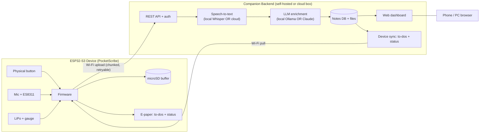

# Product Requirements Document — "PocketScribe" AI Note Taker

**Owner:** Max (maximilian.l.moore@googlemail.com)
**Status:** Draft v1 — approved requirements, ready for implementation
**Last updated:** 2026-07-18
**Target hardware:** Waveshare **ESP32-S3-Touch-ePaper-1.54** (200×200 B/W e-paper, touch, ES8311 audio codec + mic, microSD, RTC, SHTC3 temp/humidity sensor, onboard LiPo charge circuit — *ships without a battery cell*)

---

## 1. Vision

A pocket device that lets Max **capture spoken thoughts on the go** and **record meetings** at the press of a physical button. Recordings are stored on the device and, when Wi-Fi is available, **synced to a backend** that transcribes them and uses AI to produce **clean notes, action items, meeting summaries, and auto titles/tags**. Everything is browsable from a **web dashboard** on phone or PC. The e-paper screen shows glanceable info (to-do list, status). Above all: **installation must be effortless for a non-embedded-developer.**

### Design principles
1. **Zero-toolchain install** — flash from a browser, provision Wi-Fi from a phone. No IDE, no command line.
2. **Capture must never fail** — recording works fully offline; sync is a separate, retryable step.
3. **The backend is the brain** — the ESP32-S3 records and displays; all heavy AI runs on the backend.
4. **Privacy is a choice, not a default loss** — hybrid backend lets Max run everything locally or use cloud APIs per his preference.

---

## 2. Confirmed requirements (from scoping)

| Decision | Choice |
|---|---|
| AI processing location | **Hybrid / configurable**; **MVP is cloud-first** (Whisper API + Claude), local path (faster-whisper + Ollama) wired after |
| Backend host | **Max's home server** — Intel **i5-9500T**, **16 GB RAM, no GPU**. Local Whisper OK on CPU; local LLM only small/slow → cleanup/summaries best via cloud Claude |
| Transcription timing | **Record-then-sync** (no live on-device transcript) |
| Power | **Add a LiPo cell** — firmware manages battery + safe low-power shutdown; USB power bank also works |
| Note access | **Web dashboard**, reachable over the **internet via Max's own domain, password-protected + HTTPS** (Phase 2 hardening) |
| Language | **German + English**, auto-detected per recording; outputs in the language spoken |
| Interaction | **Buttons only — no touch** (assumed until Max confirms on hardware). Board exposes **2 usable buttons** (BOOT + PWR) + RESET. **Button A = Navigate, Button B = Record** (roles provisional, finalized at bring-up) |
| Recording control | **Button B** — short press = Quick Note start/stop, long press = Meeting start/stop |
| Device display | **View-only browse**: Home/status, **To-do list**, **captured Notes** (title + category), **Meeting transcripts** list. Navigation via **Button A** (short = next page/item, long = next section) |
| Firmware framework | **Arduino-ESP32** |
| AI outputs per note | **Cleaned-up version + Action items + Meeting summary + Auto title & tags** (raw transcript always kept) |

---

## 3. Hardware reference & constraints

| Component | Detail | Consequence for design |
|---|---|---|
| MCU | ESP32-S3-PICO-1-**N8R8** — dual-core LX7 @240MHz, **8MB flash, 8MB PSRAM** | Enough for audio buffering + Opus encoding; **not** enough for on-device speech-to-text |
| Display | 1.54" **e-paper**, 200×200, B/W | Slow refresh (partial ~0.3s, full ~2s). Use for **static/glanceable** screens; use partial refresh for status changes. Not for scrolling text |
| Touch | **Assume NOT present** until confirmed on hardware (Max believes this unit has no touch) | UI must work with **buttons only**; no design depends on touch |
| Buttons | **2 usable** — BOOT (GPIO0) + PWR, both programmable — plus RESET | All interaction (navigate + record) rides on these 2. RESET is not a UI input. BOOT held at power-on = flash mode; PWR may tie into power management → confirm dual-use at bring-up |
| Audio | ES8311 codec + microphone (I²S) | Capture at **16 kHz mono**; the codec, not the CPU, does the analog work |
| Storage | **microSD (TF) slot** | Buffers recordings offline; sync when Wi-Fi returns. **A microSD card is required** (document as a purchase item) |
| Power | Onboard **LiPo charge management**; ships with **no cell** | Add a ~3.7V LiPo (e.g. 800–1200 mAh). Firmware reads battery voltage, warns low, safe-shuts-down |
| Sensors | RTC (timestamps), SHTC3 temp/humidity | RTC timestamps recordings even offline; temp/humidity optional dashboard widget |
| Connectivity | 2.4 GHz Wi-Fi, BLE 5 | Wi-Fi for sync/provisioning. BLE reserved for future phone provisioning |
| USB | Native USB (CDC/JTAG) | Enables **browser-based flashing** (Web Serial) — key to the easy-install goal |

**Audio storage math:** raw 16 kHz mono PCM ≈ 115 MB/hour. **Opus @ ~24 kbps ≈ ~11 MB/hour.** Target Opus encoding on-device (chunked); WAV is the MVP fallback. Any modern microSD handles hours of either.

---

## 4. System architecture



**Three deliverables:**
1. **Firmware** (ESP-IDF or Arduino-ESP32) — capture, buffer, sync, display, power.
2. **Backend** (FastAPI/Python, Dockerized) — ingest, transcribe, enrich, store, serve API + dashboard.
3. **Web dashboard** (served by backend) — browse/search notes, to-dos, summaries.

---

## 5. Personas & core use cases

- **UC-1 Quick thought (on the go):** Max presses the button, speaks 20s, presses to stop. Later at his desk (Wi-Fi), it syncs → he gets a cleaned note + any to-dos in the dashboard.
- **UC-2 Meeting:** Long-press to start a meeting recording, long-press to stop (up to ~2 h). Device shows "● REC 12:04" and elapsed time. On sync he gets raw transcript + summary + action items + title/tags.
- **UC-3 Glance at to-dos:** Walking past his desk, the e-paper shows his current open to-dos and last-sync time — no phone needed.
- **UC-4 Review & organize:** In the dashboard he reads cleaned notes, ticks off to-dos, searches past meetings by title/tag.

---

## 6. Functional requirements

### 6.0 Interaction model (buttons only, no touch)
Two usable buttons. Roles are **provisional** pending hardware bring-up:
- **Button A — Navigate:** short press = next page/item on the current screen; long press = switch section (Home → To-dos → Notes → Meetings → Home).
- **Button B — Record:** short press = Quick Note start/stop; long press = Meeting start/stop.
- While recording, any Button B press stops; a low-battery event auto-stops and finalizes (FR-P2).
- Debounce + press-length detection in firmware; visual confirmation on the e-paper for every action (no silent presses).

### 6.1 Firmware — capture (must-have)
- **FR-C1** **Button B short press** → start **Quick Note**; short press again → stop.
- **FR-C2** **Button B long press** (≥1.5s) → start **Meeting**; long press → stop. (Distinct modes tag the recording so the backend applies the right AI pipeline.)
- **FR-C3** Record 16 kHz mono to microSD. **Opus** target; **WAV** MVP fallback. Files chunked (e.g. 5-min segments) so long meetings and interrupted uploads are safe.
- **FR-C4** Each recording gets a **manifest**: RTC timestamp, mode (quicknote/meeting), duration, device ID, sync status, checksum.
- **FR-C5** Capture works with **no Wi-Fi**. Never block recording on network.
- **FR-C6** Clear capture feedback on e-paper: idle → "● REC + timer" → "Saved ✓". A short LED/haptic-style visual cue on start/stop.
- **FR-C7** Graceful handling of: SD full, SD missing, recording interrupted by low battery (flush + finalize current chunk).

### 6.2 Firmware — sync (must-have)
- **FR-S1** When Wi-Fi is available, upload unsynced recordings to backend `POST /ingest` in chunks, **resumable** and **retryable** with backoff.
- **FR-S2** Mark uploaded chunks; delete from SD only after backend confirms receipt (configurable retention).
- **FR-S3** Pull down the current **to-do list** and **status** for the e-paper (`GET /device/state`).
- **FR-S4** Sync is idempotent (checksums + IDs prevent duplicates).

### 6.3 Firmware — display (must-have)
The e-paper is a **view-only browser** of what the device has captured. **Button A navigates (short = next page/item, long = next section); Button B records.** No touch.
- **FR-D1** **Home/status screen:** date/time (RTC), Wi-Fi + battery + sync status icons, counts (# notes, # meetings, # open to-dos), last sync time.
- **FR-D2** **To-do screen:** current open to-do list (view-only; paged if long).
- **FR-D3** **Notes screen:** list of captured Quick Notes — **title + category tag** + date; newest first, paged.
- **FR-D4** **Meetings screen:** list of captured meeting transcripts — title + date + duration; paged.
- **FR-D5** **Recording screen:** mode label + elapsed timer + level indicator (auto-shown while recording).
- **FR-D6** Titles/categories/to-dos come from backend `GET /device/state` on sync; until a note is processed it shows as "Pending sync"/"Processing…".
- **FR-D7** Use **partial refresh** for timers/paging to avoid full-screen flashing; full refresh on screen change / periodic ghosting cleanup.

### 6.4 Firmware — power (must-have, since LiPo added)
- **FR-P1** Read battery voltage/percentage; show on e-paper.
- **FR-P2** **Low-battery warning** + **safe shutdown** that finalizes the current recording chunk first.
- **FR-P3** **Deep-sleep** when idle; wake on button press. E-paper retains last image with no power draw.

### 6.5 Onboarding & installation (must-have — top usability priority)
- **FR-O1 Browser flashing:** an **Install web page** (GitHub Pages) with an **"Install" button** using **ESP Web Tools / Web Serial** (Chrome/Edge). Plug in USB → click → prebuilt firmware flashes. No IDE, no manual driver install where the native USB path allows.
- **FR-O2 Wi-Fi provisioning:** on first boot the device starts a **SoftAP + captive portal** ("PocketScribe-Setup"). Max connects his phone, a page opens automatically, he enters: Wi-Fi SSID/password, **backend URL**, and a **pairing token**. Credentials stored in NVS.
- **FR-O3 Recovery:** hold button on boot to re-enter setup / factory reset.
- **FR-O4** A **10-minute Quick-Start guide** (in repo + on install page): what to buy (microSD, LiPo), flash, provision, first recording.

### 6.6 Backend (must-have)
- **FR-B1** `POST /ingest` — accept chunked audio + manifest; reassemble; enqueue processing; return confirmation IDs (for FR-S2).
- **FR-B2** **Transcription** — pluggable engine: **local faster-whisper** or **cloud (OpenAI Whisper / Deepgram)**, selected in config. Auto-detect DE/EN.
- **FR-B3** **LLM enrichment** — pluggable engine: **local Ollama** or **Claude API**. Produces, per note:
  - Cleaned-up text (remove filler/false starts, keep meaning),
  - Action items (structured; capture owner/date if spoken),
  - Meeting summary (meetings only: key points + decisions),
  - Auto title + tags.
  Output language = spoken language.
- **FR-B4** **Storage** — SQLite + filesystem for MVP (single user); schema in §8. Keep raw audio (configurable retention) + raw transcript + all AI outputs.
- **FR-B5** `GET /device/state` — return the payload the e-paper browses: open to-dos, recent **notes** (title + category + date), recent **meetings** (title + date + duration), and counts + status (FR-S3, FR-D1–D6). Compact/paged for the small screen.
- **FR-B6** **Auth** — device uses the pairing token; dashboard behind a password login. Designed to be exposed on Max's **own domain over HTTPS** (see FR-W6).
- **FR-B7** **One-command deploy** — `docker compose up`; all config via a single `.env` (engine choices, API keys, retention, language hints).
- **FR-B8** Idempotent ingest; processing is a retryable job queue (failed transcription/LLM calls don't lose audio).

### 6.7 Web dashboard (must-have)
- **FR-W1** Notes list with title, date, mode, tags; **search** by text/tag.
- **FR-W2** Note detail: tabs/sections for **Cleaned note · Raw transcript · Summary · Action items**; play back original audio.
- **FR-W3** **To-do view** across all notes: check off (writes back; surfaces to device via FR-B5), filter open/done.
- **FR-W4** Responsive (phone + desktop).
- **FR-W5** Re-run enrichment on a note (e.g. after switching engines) and edit cleaned text/to-dos manually.
- **FR-W6** **Internet-accessible on Max's own domain, password-protected, HTTPS.** Backend runs on the home server; the dashboard is reachable publicly via a reverse proxy or secure tunnel with a login. Options documented: (a) reverse proxy (Caddy/Nginx) with Let's Encrypt on a port-forward, or (b) **Cloudflare Tunnel / Tailscale** to avoid opening ports. Recommended: Cloudflare Tunnel + login — no router changes, automatic HTTPS.

---

## 7. Non-functional requirements
- **NFR-1 Usability:** a non-technical user completes flash → provision → first synced note in **under 15 minutes** following the guide.
- **NFR-2 Reliability:** no captured audio is ever lost due to network/power; all sync/processing steps are retryable.
- **NFR-3 Privacy:** local-only mode must keep audio, transcripts, and notes entirely on Max's hardware; no cloud calls when local engines are configured.
- **NFR-4 Performance (device):** button-press → recording-started ≤ 1s; deep-sleep idle current low enough for all-day standby on a ~1000 mAh LiPo.
- **NFR-5 Security:** pairing token + dashboard auth; secrets in `.env`/NVS, never in the repo; HTTPS supported for the backend.
- **NFR-6 Maintainability:** firmware config (backend URL, chunk size, sample rate) adjustable without reflashing where possible (via provisioning/NVS).

---

## 8. Data model (backend, MVP)

```
Recording(id, device_id, mode[quicknote|meeting], started_at, duration_s,
          audio_path, language, sync_status, checksum, created_at)
Transcript(id, recording_id, engine, language, text, segments_json, created_at)
Note(id, recording_id, title, cleaned_text, summary, tags[], created_at, updated_at)
Todo(id, note_id, text, owner?, due?, status[open|done], created_at, updated_at)
Device(id, name, paired_token_hash, last_seen_at, battery_pct, fw_version)
```

Device state endpoint returns: `{ open_todos: [...top N...], pending_uploads, last_sync_at, backend_ok }`.

---

## 9. AI processing pipeline (per recording)
1. Ingest & reassemble chunks → finalized audio file.
2. Transcribe (engine per config) → raw transcript + segments + detected language.
3. If **meeting** → generate summary; always → cleaned text, action items, title, tags.
4. Persist Note + Todos; update device state.
5. On failure at any step: keep audio, mark job failed, allow manual/auto retry (FR-B8).

Prompts are versioned and language-aware (DE/EN). Cleaning prompt explicitly: remove fillers/false starts, preserve meaning and Max's intent, do not invent content.

---

## 10. Bill of materials (what Max needs to buy)
- The board (owned).
- **microSD card** (e.g. 16–32 GB, Class 10) — **required**.
- **LiPo cell** ~800–1200 mAh with the matching connector for the board's charge circuit — required for portability.
- USB-C cable (flashing + charging). Optional USB power bank as an alternative to the LiPo.
- A machine to run the backend (his server/NAS/Raspberry Pi/mini-PC) **or** a small cloud VM.

---

## 11. Phased roadmap

**Phase 0 — Foundations (repo scaffolding)**
Repo layout (`/firmware`, `/backend`, `/dashboard`, `/docs`), CI build of firmware binary, backend skeleton, this PRD.

**Phase 1 — MVP capture→sync→read (the core loop)**
- Firmware: button capture (both modes), WAV to microSD, Wi-Fi provisioning, browser flashing, basic e-paper (home/recording/status), chunked upload.
- Backend: ingest, one transcription engine (pick default), one LLM engine, SQLite, `/ingest` + `/device/state`.
- Dashboard: notes list + detail + to-do view.
- **Goal:** press button → speak → see cleaned note + to-dos in browser.

**Phase 2 — Enrichment, browse & remote access**
- Meeting summaries, auto title/tags, DE/EN auto-detect, engine pluggability (local/cloud toggle), Opus encoding, battery management + safe shutdown.
- Device **touch navigation** across Home / To-dos / Notes / Meetings screens.
- **Internet-facing dashboard** on Max's domain (Cloudflare Tunnel + login, HTTPS), search, re-run/edit.

**Phase 3 — Optional extensions**
- Local engine path hardening (faster-whisper + Ollama on the home server), Obsidian/Notion export, touch UI refinements, BLE provisioning, temp/humidity widget, multi-device.

---

## 12. Decisions locked & remaining assumptions

**Resolved:**
1. **MVP engines:** cloud-first (Whisper API + Claude); local path (faster-whisper + Ollama) wired after. ✅
2. **Backend host:** Max's home server — i5-9500T, 16 GB RAM, no GPU. Deploy guide targets Docker on this box. Local Whisper feasible; local LLM small-only. ✅
3. **Firmware framework:** Arduino-ESP32. ✅
4. **Dashboard access:** internet-facing on Max's own domain, password-protected + HTTPS (Cloudflare Tunnel recommended). ✅
5. **Device display:** browsable Home / To-dos / Notes / Meetings, **buttons only** — Button A navigates, Button B records. ✅

**Still assumed (correct me if wrong):**
- **A1 Board variant** = N8R8 (8MB/8MB) with onboard mic via ES8311, **assumed NO touch** (per Max), **2 usable buttons** (BOOT + PWR). Confirm touch presence, button count, and which button is safe for Record vs Navigate at first hardware bring-up. If the unit *does* have touch, we can add optional touch nav later without changing the button flow.
- **A2 Meeting length cap** ~2 h per recording.
- **A3 Retention:** keep raw audio after processing by default (configurable).
- **A4 Cloud provider keys:** Max supplies an Anthropic (Claude) API key and a Whisper-capable key (OpenAI) for the cloud path.
- **A5 Domain/tunnel:** exact domain + whether Cloudflare Tunnel vs port-forward is a setup-time choice; both documented.

## 13. Out of scope (v1)
Live on-device transcription; speaker diarization/attribution; calendar integration; sharing/multi-user accounts; native mobile app (dashboard is a responsive web app).

---

### Next step
Once you confirm §12 (especially items 2–4), I'll scaffold the repo (Phase 0) and start Phase 1. The very first thing you'll be able to do is flash from a web page and record a note — proving the easy-install goal early.
